# Aligna System Architecture

**Version:** 2.0 (AI-Enhanced)  
**Last Updated:** October 27, 2025  
**Project:** Aligna - AI-Powered Team Collaboration Platform

---

## Table of Contents

1. [System Overview](#system-overview)
2. [High-Level Architecture](#high-level-architecture)
3. [Frontend Architecture](#frontend-architecture)
4. [Backend Architecture](#backend-architecture)
5. [Data Models](#data-models)
6. [AI Processing Pipeline](#ai-processing-pipeline)
7. [Real-Time Communication](#real-time-communication)
8. [Security Architecture](#security-architecture)
9. [Data Flow Patterns](#data-flow-patterns)
10. [Deployment Architecture](#deployment-architecture)

---

## System Overview

Aligna is a real-time messaging platform built for remote teams, enhanced with AI-powered productivity features. The system combines React Native for cross-platform mobile apps with Firebase for backend infrastructure and OpenAI for intelligent features.

### Key Components

- **Mobile App** (React Native + Expo)
- **Firebase Backend** (Firestore, Realtime DB, Storage, Auth)
- **AI Backend** (Firebase Cloud Functions + OpenAI + Pinecone)
- **Real-time Services** (Presence, Typing Indicators)
- **Push Notifications** (Firebase Cloud Messaging)

---

## High-Level Architecture

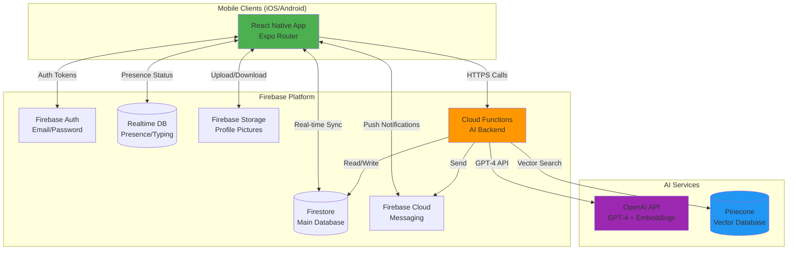

### Technology Stack

| Layer | Technologies |
|-------|-------------|
| **Frontend** | React Native 0.81, Expo ~54, TypeScript 5.9, Expo Router |
| **Backend** | Firebase (Firestore, Realtime DB, Storage, Auth, FCM) |
| **AI Services** | OpenAI (GPT-4, text-embedding-3-small), Pinecone |
| **Cloud Functions** | Node.js 18, TypeScript, Firebase Functions |
| **State Management** | React Context + useReducer |

---

## Frontend Architecture

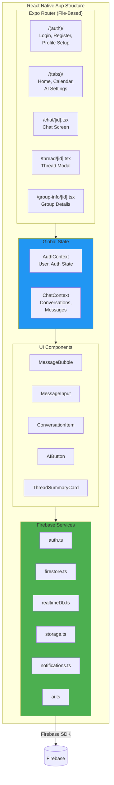

### Directory Structure

```
/app                          # Expo Router pages
  /(auth)                     # Authentication flow
    login.tsx                 # Login screen
    register.tsx              # Registration
    profile-setup.tsx         # Profile creation
  /(tabs)                     # Main app tabs
    index.tsx                 # Conversations list
    calendar.tsx              # Calendar view
    ai-settings.tsx           # AI feature settings
  /chat/[id].tsx             # Chat screen (dynamic route)
  /thread/[id].tsx           # Thread modal
  /group-info/[id].tsx       # Group info modal
  action-items.tsx           # Action items view
  decisions.tsx              # Decisions log
  search.tsx                 # Semantic search

/components                   # Reusable UI components
  MessageBubble.tsx          # Message display
  MessageInput.tsx           # Message composition
  ConversationItem.tsx       # Conversation list item
  AIButton.tsx               # AI feature trigger
  ThreadSummaryCard.tsx      # Thread summary display
  TypingIndicator.tsx        # Typing animation
  PresenceIndicator.tsx      # Online/offline status

/contexts                     # Global state management
  AuthContext.tsx            # Authentication state
  ChatContext.tsx            # Chat/message state

/services/firebase            # Firebase service layer
  auth.ts                    # Authentication operations
  firestore.ts               # Firestore CRUD operations
  realtimeDb.ts              # Presence/typing indicators
  storage.ts                 # File upload/download
  notifications.ts           # Push notification handling
  ai.ts                      # AI feature API calls

/types                        # TypeScript type definitions
  index.ts                   # User, Message, Conversation, etc.
```

### State Management Pattern

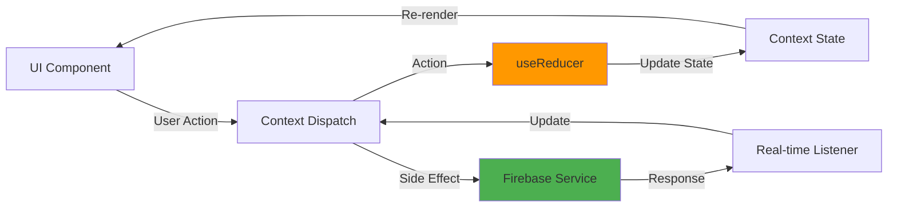

**Key Pattern: Optimistic Updates**

1. User sends message → Dispatch `ADD_MESSAGE` with `tempId`
2. UI updates immediately (status: `sending`)
3. Firebase service sends to Firestore
4. Real-time listener receives confirmed message
5. Dispatch `UPDATE_MESSAGE` with real ID (status: `sent`)
6. UI shows checkmark

---

## Backend Architecture

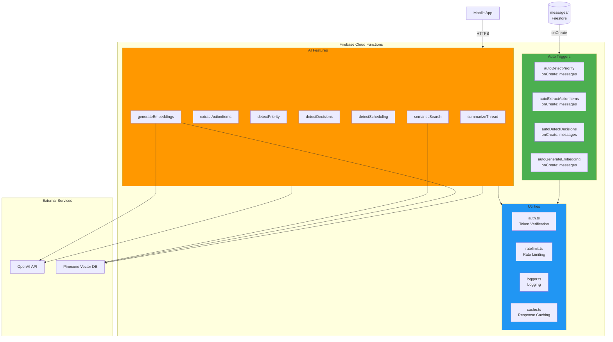

### Cloud Functions Architecture

#### Function Modules

```
/functions/src
  /ai                        # AI infrastructure
    openai.ts               # OpenAI client wrapper
    embeddings.ts           # Embedding generation
    prompts.ts              # Prompt templates
    cache.ts                # Response caching
    
  /features                  # AI feature functions
    summarizeThread.ts      # Thread summarization
    extractActionItems.ts   # Action item extraction
    detectPriority.ts       # Priority detection
    detectDecisions.ts      # Decision detection
    detectScheduling.ts     # Scheduling suggestions
    semanticSearch.ts       # Vector-based search
    generateEmbeddings.ts   # Embedding pipeline
    sendPushNotification.ts # Push notifications
    
  /shared                    # Shared utilities
    auth.ts                 # Firebase token verification
    ratelimit.ts            # Per-user rate limiting
    logger.ts               # Structured logging
    
  index.ts                  # Function exports
```

#### Function Types

| Function | Trigger Type | Purpose |
|----------|--------------|---------|
| `summarizeThread` | HTTPS Callable | User-initiated thread summary |
| `extractActionItems` | HTTPS Callable | Manual action item extraction |
| `semanticSearch` | HTTPS Callable | User search query |
| `detectScheduling` | HTTPS Callable | Scheduling suggestions |
| `autoDetectPriority` | Firestore onCreate | Auto-flag priority messages |
| `autoExtractActionItems` | Firestore onCreate | Auto-extract action items |
| `autoDetectDecisions` | Firestore onCreate | Auto-log decisions |
| `autoGenerateEmbedding` | Firestore onCreate | Auto-index for search |

---

## Data Models

### Firestore Collections

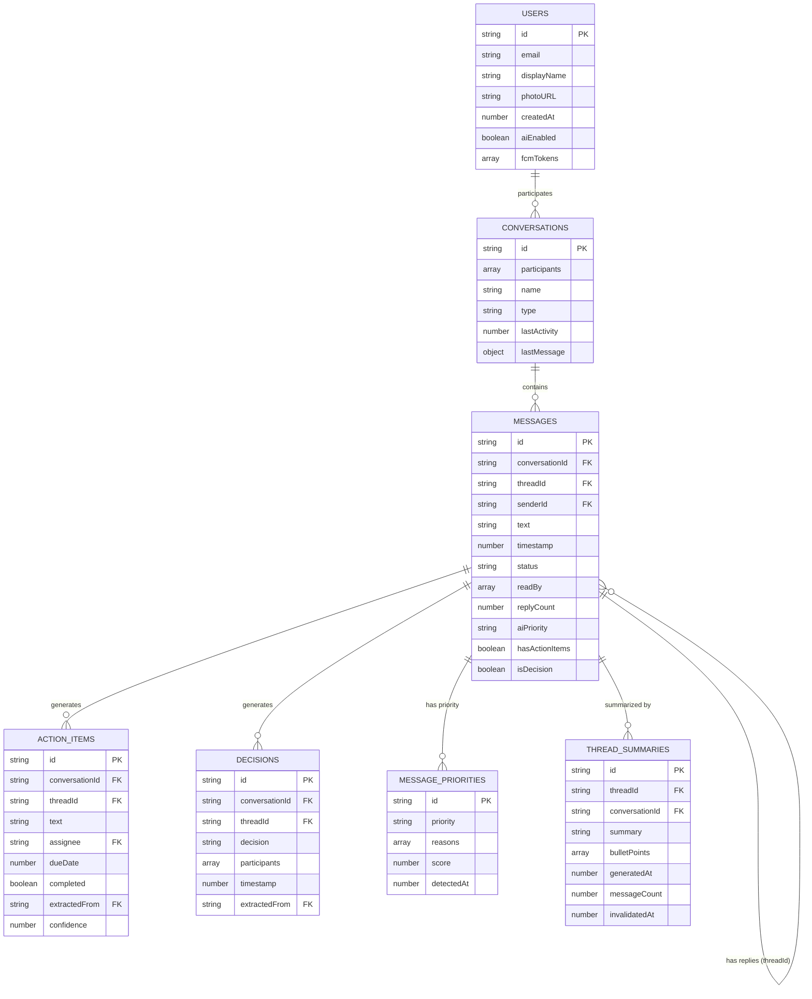

### Realtime Database Structure

```
/presence/{userId}
  status: 'online' | 'offline'
  lastSeen: timestamp
  activeConversationId: string?

/typing/{conversationId}/{userId}
  isTyping: boolean
  timestamp: number
```

### Pinecone Vector Index

```
Index: aligna-messages
Dimension: 1536 (text-embedding-3-small)

Metadata per vector:
{
  messageId: string
  conversationId: string
  threadId?: string
  senderId: string
  timestamp: number
  textPreview: string  // First 200 chars
}
```

---

## AI Processing Pipeline

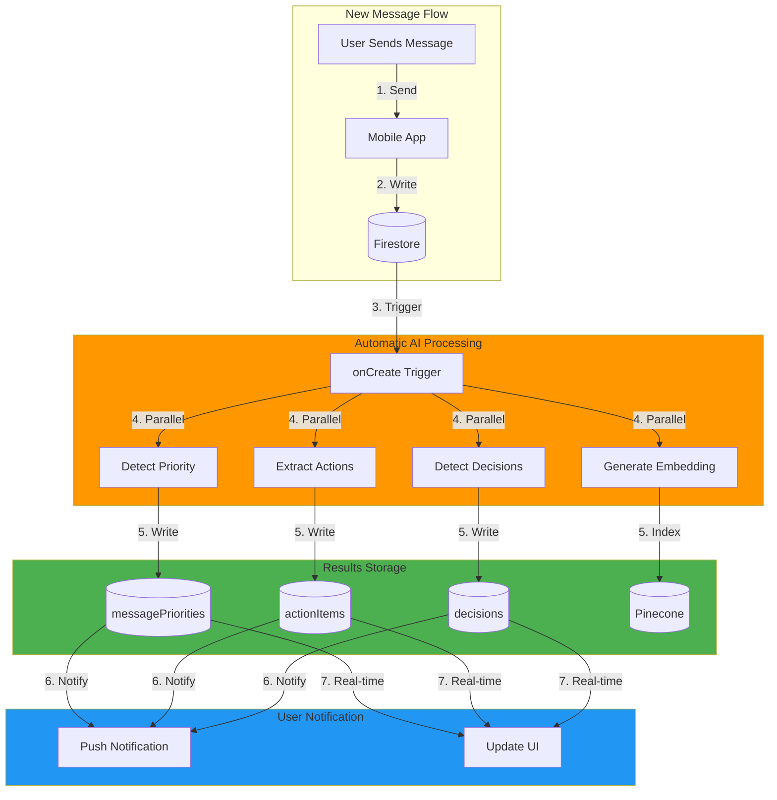

### AI Feature Details

#### 1. Thread Summarization

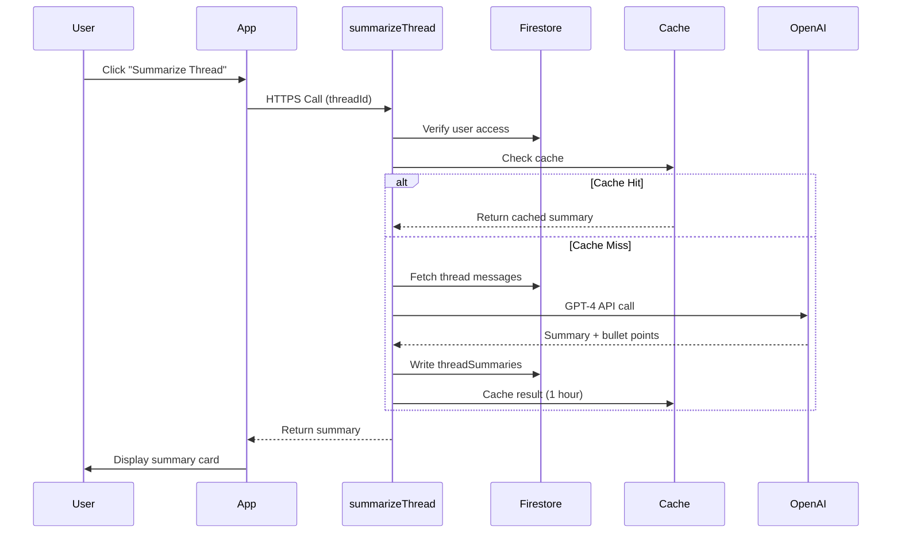

**Key Implementation:**
- Uses GPT-4 for high-quality summaries
- Caches for 1 hour or until new messages
- Rate limited to 1 summary/thread/minute per user
- Processes up to 100 messages per thread

#### 2. Semantic Search

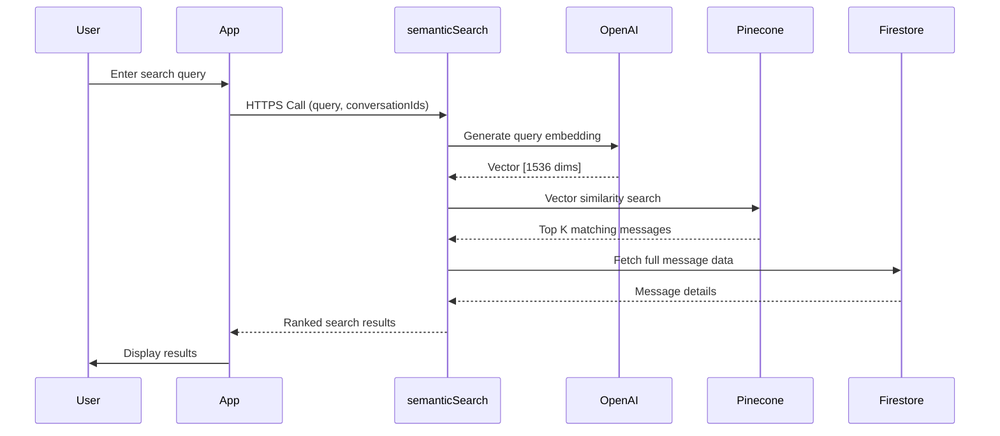

**Key Implementation:**
- text-embedding-3-small for cost efficiency
- Vector similarity using cosine distance
- Filters by conversation access rights
- Returns top 20 results with context

#### 3. Priority Detection

**Criteria:**
- Contains urgent keywords ("ASAP", "urgent", "critical")
- Mentions (@user)
- Question marks (implies action needed)
- Time-sensitive language ("today", "now", "deadline")
- Sentiment analysis (high arousal/urgency)

**Scoring:**
- `high`: score ≥ 0.7
- `medium`: score ≥ 0.4
- `low`: score < 0.4

#### 4. Action Item Extraction

**Detected Patterns:**
- "Can you [action]?"
- "Please [action]"
- "[Person] will [action]"
- "Let's [action]"
- "TODO: [action]"

**Output Format:**
```typescript
{
  text: "Deploy the API to production",
  assignee: "userId",  // if mentioned
  dueDate: timestamp,  // if date detected
  confidence: 0.85,    // 0-1 scale
  completed: false
}
```

---

## Real-Time Communication

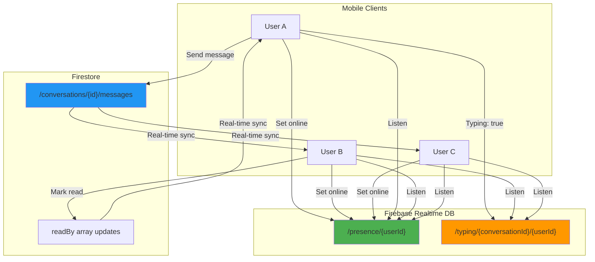

### Presence System

**Implementation:**
1. On app foreground → Set `status: 'online'`
2. Set `onDisconnect()` → Set `status: 'offline'`, `lastSeen: timestamp`
3. Listen to `/presence` for all conversation participants
4. Display green dot for online, gray for offline

**Code Pattern:**
```typescript
// services/firebase/realtimeDb.ts
export const setUserPresence = (userId: string) => {
  const presenceRef = ref(realtimeDb, `presence/${userId}`);
  
  // Set online
  set(presenceRef, {
    status: 'online',
    lastSeen: Date.now()
  });
  
  // Set offline on disconnect
  onDisconnect(presenceRef).set({
    status: 'offline',
    lastSeen: Date.now()
  });
};
```

### Typing Indicators

**Implementation:**
1. User types → Debounce 300ms → Set `isTyping: true`
2. Stop typing → Clear after 2 seconds
3. Listen to `/typing/{conversationId}` for all participants
4. Display "Alice is typing..." at bottom of chat

---

## Security Architecture

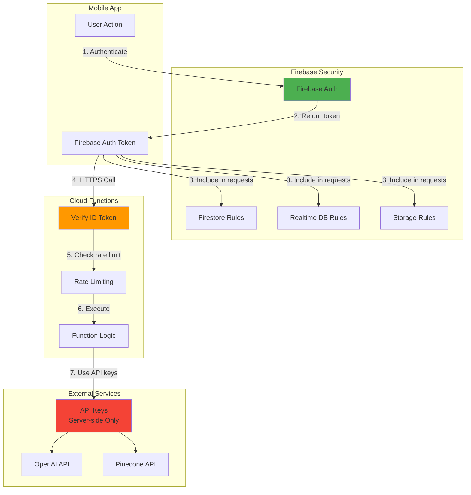

### Security Layers

#### 1. Firebase Authentication
- Email/password authentication
- Tokens stored in AsyncStorage
- Auto-refresh on expiry
- Logout clears all tokens

#### 2. Firestore Security Rules

```javascript
// firestore.rules
match /conversations/{convId} {
  allow read: if request.auth != null && 
    request.auth.uid in resource.data.participants;
  allow write: if request.auth != null && 
    request.auth.uid in resource.data.participants;
    
  match /messages/{msgId} {
    allow read: if request.auth != null && 
      request.auth.uid in get(/databases/$(database)/documents/conversations/$(convId)).data.participants;
    allow create: if request.auth != null && 
      request.auth.uid in get(/databases/$(database)/documents/conversations/$(convId)).data.participants;
  }
}
```

#### 3. Cloud Function Security

```typescript
// shared/auth.ts
export const verifyAuthToken = async (
  context: https.CallableContext
): Promise<string> => {
  if (!context.auth) {
    throw new https.HttpsError(
      'unauthenticated',
      'User must be authenticated'
    );
  }
  return context.auth.uid;
};
```

#### 4. Rate Limiting

```typescript
// shared/ratelimit.ts
const RATE_LIMITS = {
  summarizeThread: { calls: 10, window: 3600 },  // 10/hour
  semanticSearch: { calls: 50, window: 3600 },   // 50/hour
  extractActionItems: { calls: 20, window: 3600 } // 20/hour
};
```

#### 5. API Key Management

- **Storage:** Firebase Functions config (never client-side)
- **Access:** Only Cloud Functions can use API keys
- **Rotation:** Keys rotated quarterly
- **Monitoring:** Track usage and costs

#### 6. PII Protection

Before sending to OpenAI:
- Strip email addresses
- Strip phone numbers
- Strip URLs with query params
- Keep @mentions (user IDs only)

---

## Data Flow Patterns

### 1. Send Message Flow

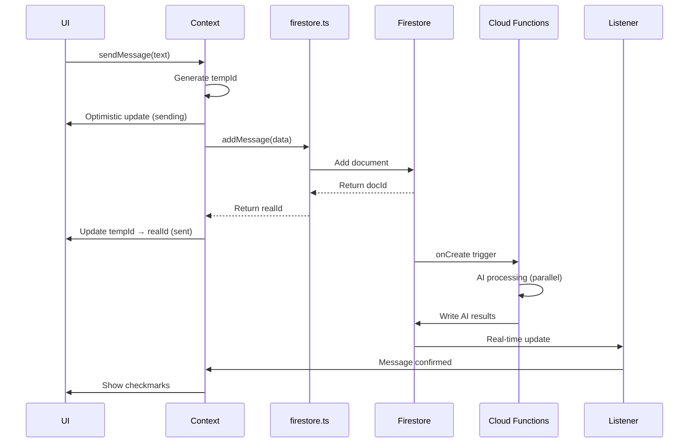

### 2. Read Receipt Flow

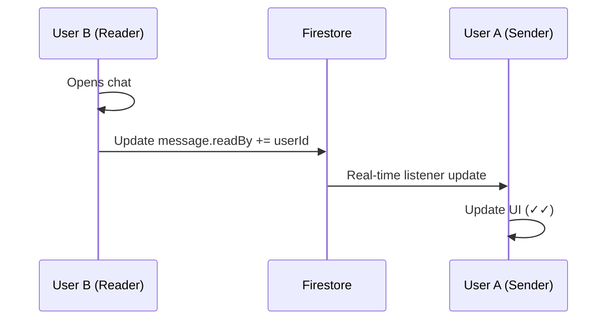

### 3. Thread Summarization Flow

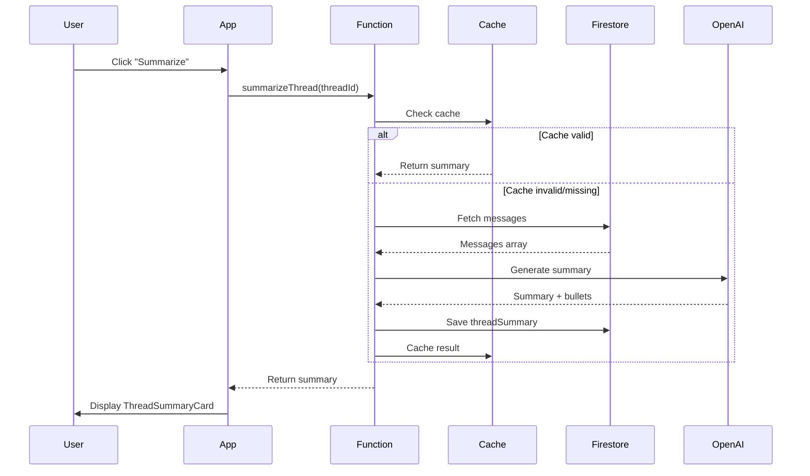

### 4. Semantic Search Flow

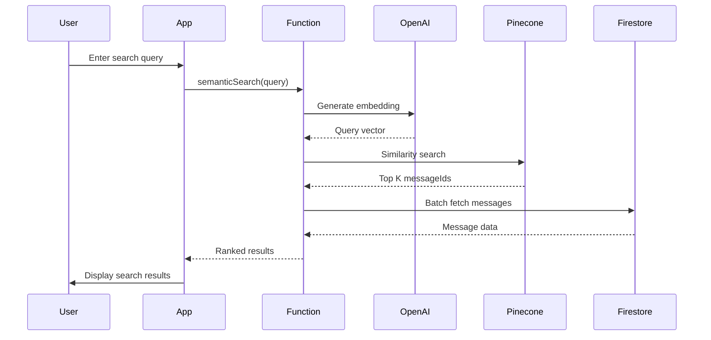

---

## Deployment Architecture

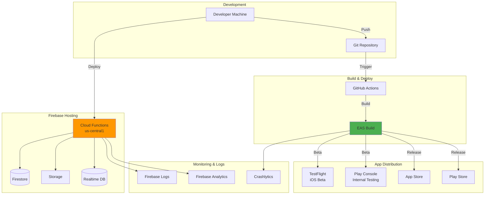

### Environment Tiers

| Tier | Purpose | Configuration |
|------|---------|---------------|
| **Development** | Local testing with Expo Go | Firebase Dev project + OpenAI test key |
| **Staging** | EAS builds for QA | Firebase Staging + OpenAI tier 1 |
| **Production** | App Store / Play Store | Firebase Prod + OpenAI tier 2 |

### Deployment Process

1. **Code Changes** → Push to GitHub
2. **Cloud Functions** → `firebase deploy --only functions`
3. **Mobile App** → EAS Build → TestFlight/Play Internal
4. **Firestore Rules** → `firebase deploy --only firestore:rules`
5. **Monitoring** → Check Firebase Console

---

## Performance Considerations

### Caching Strategy

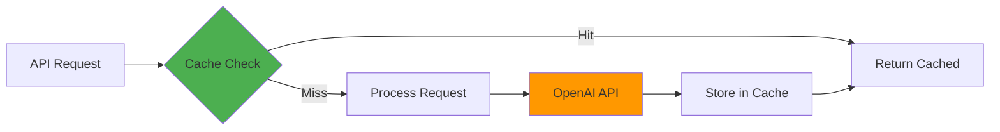

**Cache TTLs:**
- Thread Summaries: 1 hour (invalidate on new messages)
- Embeddings: Permanent (never regenerate)
- Priority Detection: 5 minutes
- Search Results: 15 minutes

### Rate Limiting

| Feature | Limit | Window |
|---------|-------|--------|
| Thread Summarization | 10 calls | per hour per user |
| Semantic Search | 50 queries | per hour per user |
| Action Item Extraction | 20 calls | per hour per user |
| Priority Detection | Auto (no limit) | N/A |

### Cost Optimization

1. **Use GPT-3.5-turbo** for background tasks (priority, actions)
2. **Use GPT-4** only for user-initiated summaries
3. **Batch embeddings** when possible
4. **Cache aggressively** to avoid duplicate API calls
5. **Rate limit** to prevent abuse

---

## Scalability Considerations

### Current Limits (Firebase Free Tier)

- **Firestore:** 20K writes/day, 50K reads/day
- **Cloud Functions:** 2M invocations/month
- **Storage:** 5GB stored, 1GB/day downloads

### Scaling Strategy

1. **Phase 1 (MVP):** Stay within free tier
2. **Phase 2 (Beta):** Upgrade to Blaze (pay-as-you-go)
3. **Phase 3 (Production):** Consider dedicated infrastructure

### Bottleneck Mitigation

| Bottleneck | Solution |
|------------|----------|
| OpenAI rate limits | Implement request queue |
| Firestore read quotas | Aggressive client-side caching |
| Cloud Function cold starts | Keep functions warm with scheduled pings |
| Vector search latency | Optimize Pinecone index settings |

---

## Future Architecture Enhancements

### Phase 3 Roadmap

1. **Real-time Collaboration**
   - Collaborative document editing
   - Shared whiteboards
   - Screen sharing

2. **Advanced AI Features**
   - Meeting transcription
   - Voice message summarization
   - Multi-language translation

3. **Enterprise Features**
   - SSO integration (SAML, OIDC)
   - Admin dashboard
   - Audit logs
   - Custom AI model fine-tuning

4. **Infrastructure Upgrades**
   - Migrate to dedicated Kubernetes cluster
   - Self-hosted vector database
   - Redis for distributed caching
   - WebSocket server for lower latency

---

## References

- [Firebase Documentation](https://firebase.google.com/docs)
- [OpenAI API Reference](https://platform.openai.com/docs)
- [Pinecone Documentation](https://docs.pinecone.io)
- [React Native Docs](https://reactnative.dev)
- [Expo Documentation](https://docs.expo.dev)

---

**Document Maintained By:** Development Team  
**Review Cycle:** Quarterly or after major changes  
**Last Reviewed:** October 27, 2025


